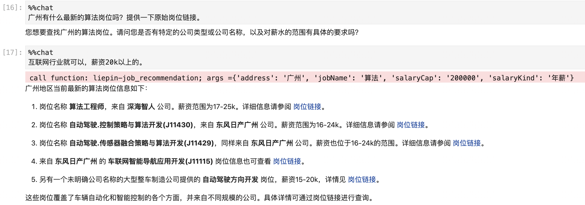

# 使用Python调用coze

coze官方只提供了curl调用范例，未提供python调用接口。

一个有毅力的吃货花了些时间利用requests库进行了实现，封装成了coze这个python库。

支持流式输出，支持多轮对话。


## 一，安装coze库

```python
pip install coze 
```

## 二，使用范例


```python
import os 
from coze import Coze 
os.environ['COZE_API_TOKEN'] = 'pat_xxx'
os.environ['COZE_BOT_ID'] = "7362845197946257419"

```


```python
chat = Coze(api_token= os.environ['COZE_API_TOKEN'],
            bot_id = os.environ['COZE_BOT_ID'],
            max_chat_rounds=20,
            stream=True)

```


你好！有什么可以帮助你的？


    register magic %%chat sucessed ...


可以使用__call__方法调用


```python
response = chat('北京最新的高级产品经理岗位有推荐吗')
```

```raw
call function: liepin-job_recommendation; args ={'address': '北京', 'jobName': '高级产品经理'}

北京近期推荐的高级产品经理岗位有以下几个，提供给对这一职业领域感兴趣的求职者：

1. 获客多 Hokdo公司提供产品经理和高级产品经理岗位，位于北京万泉河地区，产业属于计算机软件并且公司处于A轮融资阶段。提供的薪资为20-30k或25-35k，15个月薪资。招聘负责人是许先生。

2. 北京微云众网络科技有限公司招募的Futures Operations Director 职位涉及Web3 分布式产品运营，位于北京东四地区，公司规模100-499人，被标记具有较大的发展空间和国际化优势。

3. 美团是一个大规模的互联网生活服务公司，已上市，招聘的岗位是“企平-产品专家（工单平台方向）”和“财务科技-税务产品经理（海外税务方向）”，位于北京南法信，提出的薪资在30-60k和25-35k之间，均为15个月薪资。

以上职位都可以通过相应的跳转链接获取更详细的职位描述和申请方式。
```

在notebook中推荐使用jupyter魔法命令进行调用。




## 三，详细教程

参考 本项目下的 coze_tutorial.ipynb 文件
